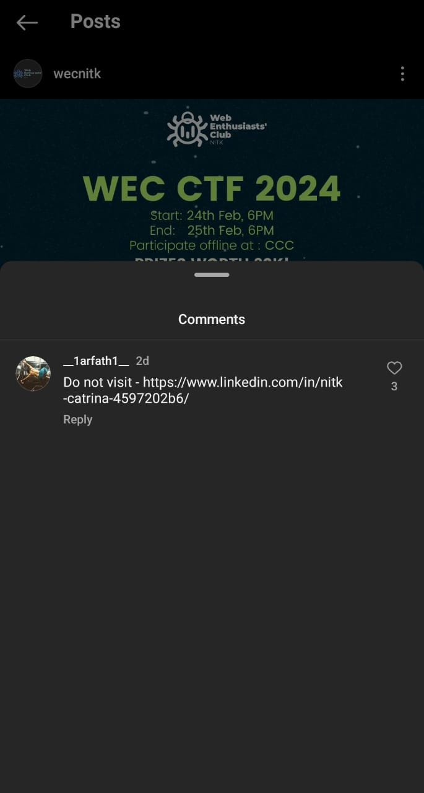

# Access Denied

First we were greeted with the challenge to reverse enginner a apk a find the secret


After installing this apk in a android device, we were greeted with a login screen asking for a username and password


Now I used dex2jar and jd-gui (Java decompiler) to analyse the apk

We can notice there are two classes which is of our interest, `LoginScreen` and `TextMe`


After analysing this class I noticed that password is hashed using MD5 and converted to hex
 ,and username is compared with string.username which will be present in strings.xml file


I used apktools to extract the files from the apk and opened string.xml file and we get to know that username is `melodi` (xD)


Remember that when we opened the app we were greeted with a login screen that had instagram profile of wecnik? So when i searched for wecnitk profile posts and comments I found a linkedin profile of nitkcatrina which had a mention to arfath11




Visiting arfath's github we have found the repository of melodi which had the password!
So the password is `jk8ssl`

Using these credentials in the app we will be greeted with a textbox `Tell me anything`


Now analysing the Textme class, 


```
Text -> Reverse it -> Take first half and xor it with key 50 -> Take second half and xor it with 65 -> Final String = Xor'ed second half + Xor'ed first half

```
This text is compared with mymessage which has wierd characters that has non-ascii chars also `V@]EAASB\022WZF\022e,a$7(&am2(3.\003`

Using the above logic to mymessage and removing the non-ascii from output we end up with `Boris, give me the password` (I used Cyberchef to do that)

Entering this in the app we get,


Searching this text in search_for_more from arfath's github profile we get a string `OO;GberoglbZ4WKbE7UhbK7qG5`


Using ASCII shift with a shift of 3, we get `LL8D_boldi_W1TH_B4Re_H4nD2`

This is only half part of the flag.
When we notice the readme file it says `You deserve a catnip too` when we search for `catnip` in happyhappyhappy.txt we get a encoded string `ZHF5357~4bN4`


Again using ASCII shift of 3, we get `WEC2024{1_K1`

Now combining both we get the FLAG `WEC2024{1_K1LL8D_boldi_W1TH_B4Re_H4nD2}`

Overall this challenge was very good and we took literally hours to find the other half of the flag (xD)
