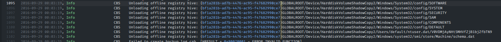

# Windows log Challenge Solution

# Problem Description
A windows event log file was given to us. We had to find the flag hidden in it.

- [Log file](./assets/Windows.log)

# Solution

I just searched for `WEC`, `{` and `}`.

Then found a base64 string.

string : V0VDMjAyNHt5MHVfZjB1bjZfbTN9

Decoding the string gives the flag.

###### flag : WEC2024{y0u_f0un6_m3}