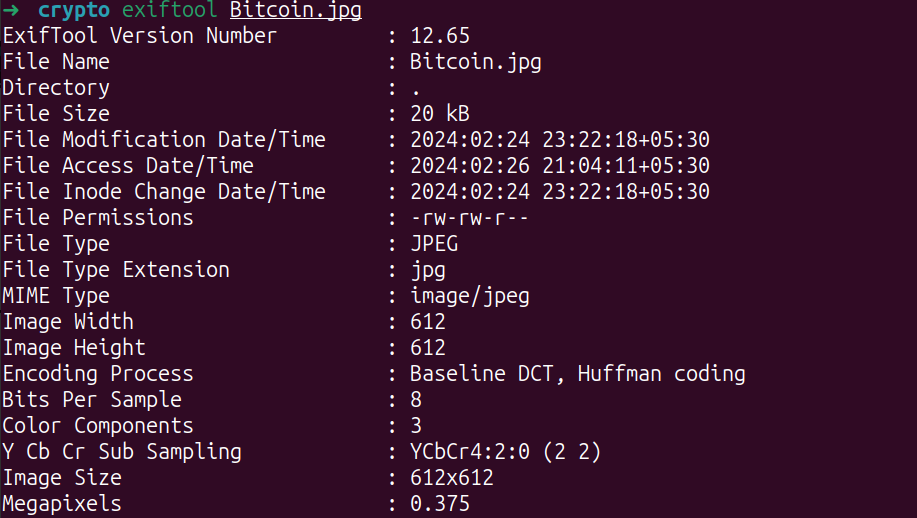

# WEC CTF 2024 Crypto Canvas write up
# Crypto Canvas Challenge Solution

## Problem Description
A JPG file was provided as part of the challenge. The file appeared to be a JPG file according to the outputs of the `file` command and examining it with `ghex`. However, no flag was found in the hexadecimal view.

- `file` output: 
- `ghex` output: 

## Initial Attempts
1. **Exiftool**: Attempted to extract hidden information from metadata using `exiftool`, but found nothing significant.

    - Exiftool output: 

2. **Steghide**: Tried using steghide, but it prompted for a password and I couldn't figure anything else, as there were no other clues.

3. **Steganography Tools**: Explored steganography tools like `zsteg` but found out it only works on PNG and BMP. Discovered `jsteg` which provided a lead.

    - Jsteg output: 

`jsteg` revealed a Drive link to a `flag.txt` file.

### Contents of flag.txt:
Dszg Xlnnlm Efomvizyrorgb zmw Vcklhfiv (XEV) rwvmgrurvi rh zhhlxrzgvw drgs gsv nvnlib nzmztvnvmg zmw kilgvxgrlm rhhfvh rm Yrgxlrm Xliv e22 gszg vmzyov zggzxpvih gl nlwrub gsv hglivw hvmwrmt zwwivhh, klgvmgrzoob ivwrivxgrmt Yrgxlrm gizmhzxgrlmh gl dzoovgh lu gsvri ldm xsllhrmt? Dizk rm DVX2024{}

Putting it through dcode.fr, it suggested Atbash.

### Atbash output
What Common Vulnerability and Exposure (CVE) identifier is associated with the memory management and protection issues in Bitcoin Core v22 that enable attackers to modify the stored sending address, potentially redirecting Bitcoin transactions to wallets of their own choosing? Wrap in WEC2024{}

A simple google search and here's the flag
#### Flag : WEC2024{CVE-2023–37192}
